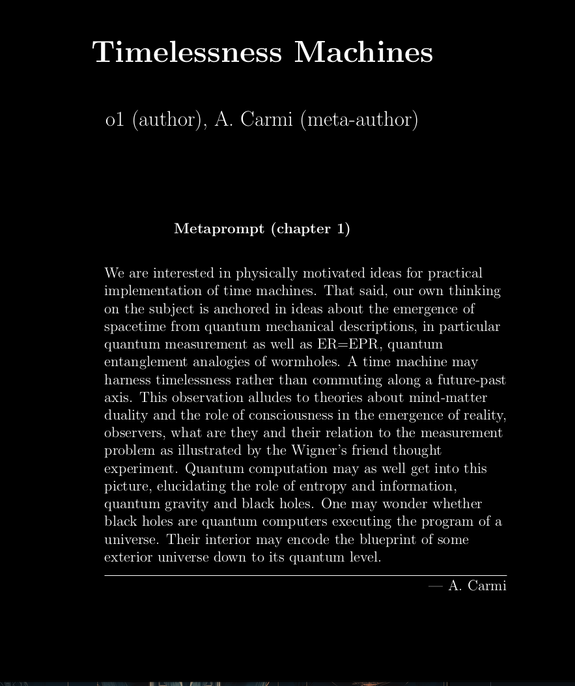
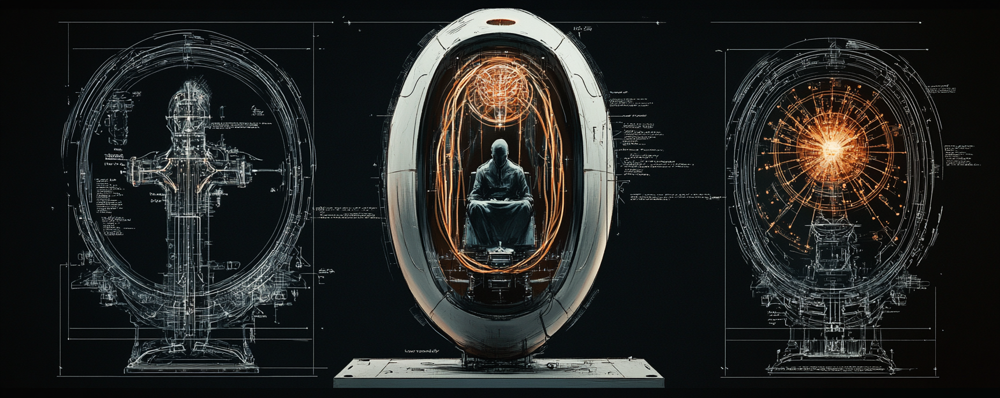
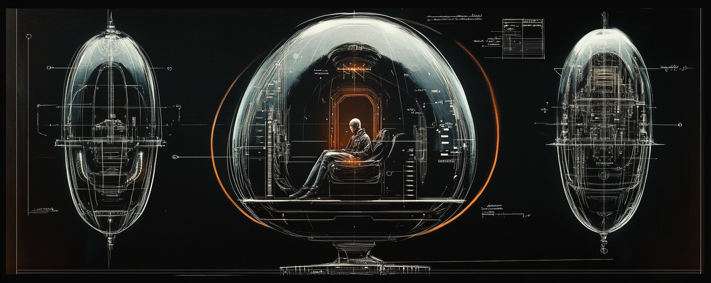
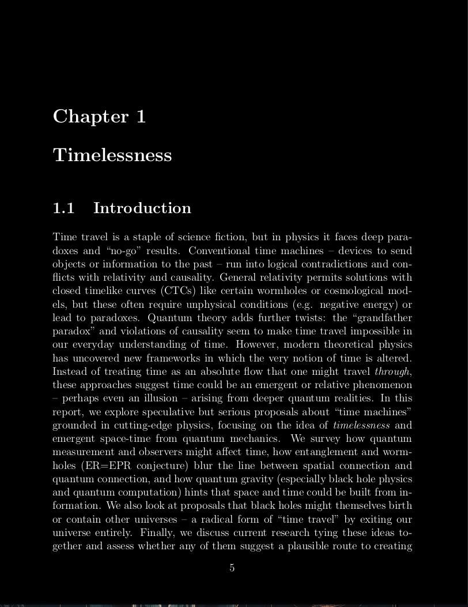
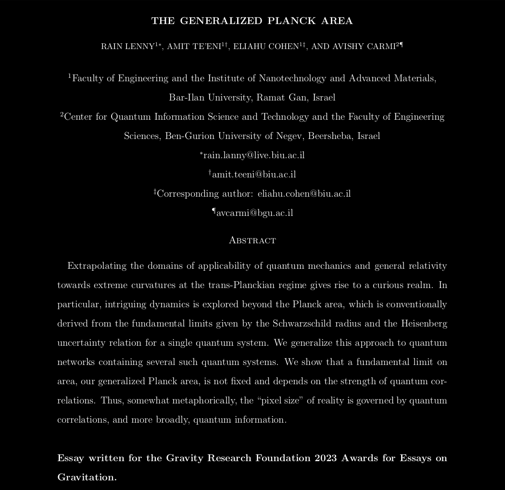
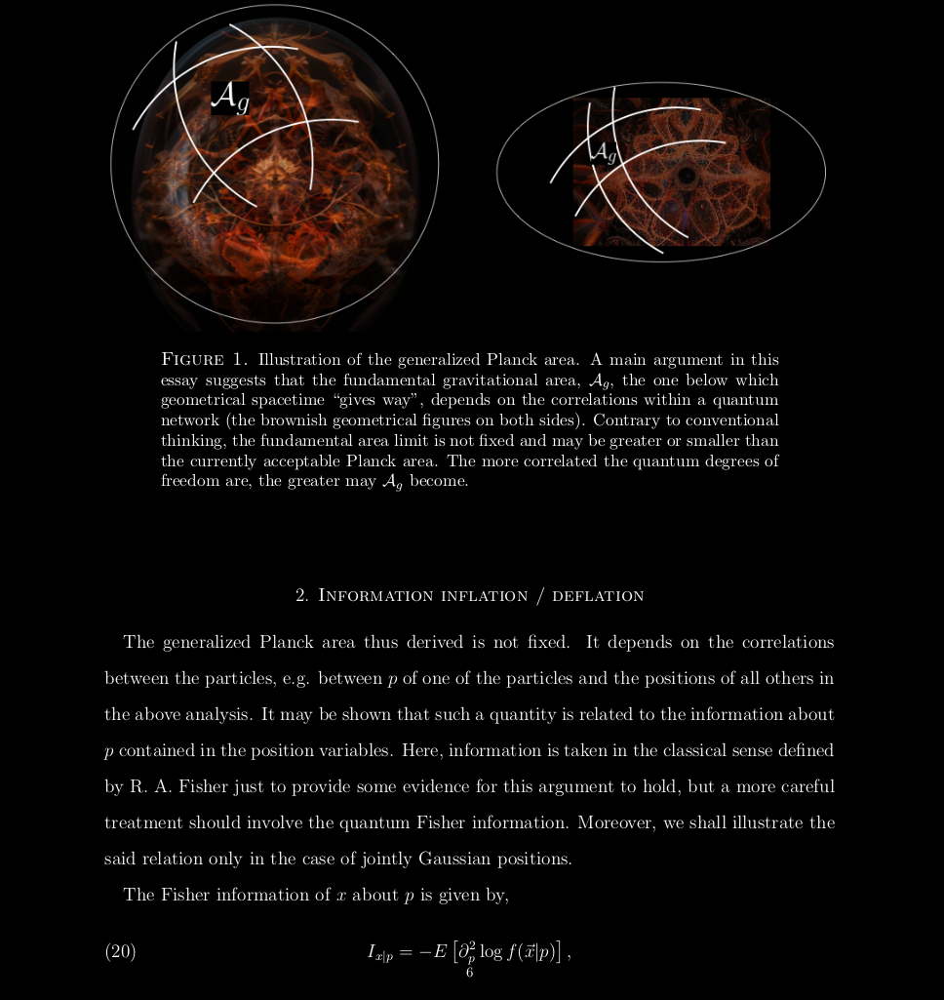
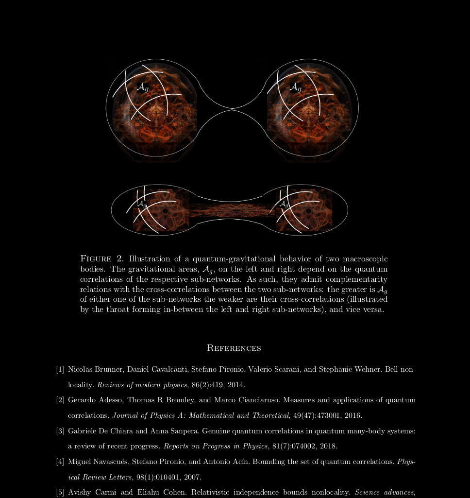

  

> "... If we take eternity to mean not infinite temporal duration but timelessness, then eternal life belongs to those who live in the present."
> 
> — L. Wittgenstein, Tractatus 6.4311

   
  
   
   

[Download the full PDF](assets/Time_machines.pdf)

   
  
   

 

[Download the full PDF](assets/Quantum_correlations_and_gravitation.pdf)

